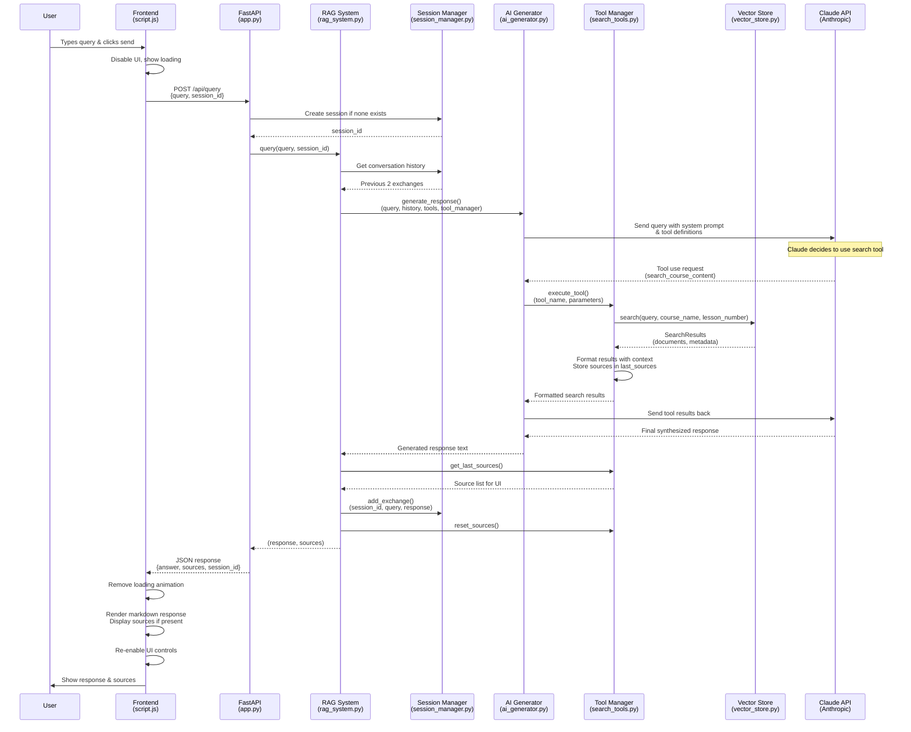

# User Query Flow Diagram

## Key Components & Data Flow

### 1. **Frontend Layer** (`frontend/script.js`)
- Captures user input
- Manages UI state (loading, disabled controls)
- Handles API communication
- Renders responses with markdown + sources

### 2. **API Layer** (`backend/app.py`)
- FastAPI endpoint `/api/query`
- Session management
- Error handling & HTTP responses

### 3. **Orchestration Layer** (`backend/rag_system.py`)
- Coordinates all components
- Manages conversation history
- Tool registration & source tracking

### 4. **AI Generation** (`backend/ai_generator.py`)
- Claude API interaction
- Tool execution workflow
- Response synthesis

### 5. **Search Tools** (`backend/search_tools.py`)
- `CourseSearchTool` for semantic search
- Result formatting with context
- Source tracking for UI

### 6. **Data Layer** (`backend/vector_store.py`)
- ChromaDB vector search
- Course/lesson filtering
- Embedding-based retrieval

## Architecture Highlights

- **Tool-Based**: Claude autonomously decides when to search
- **Session-Aware**: Maintains conversation context (2 previous exchanges)
- **Source Tracking**: UI shows which courses/lessons were referenced
- **Async Flow**: Loading states while processing
- **Error Handling**: Graceful failure modes throughout